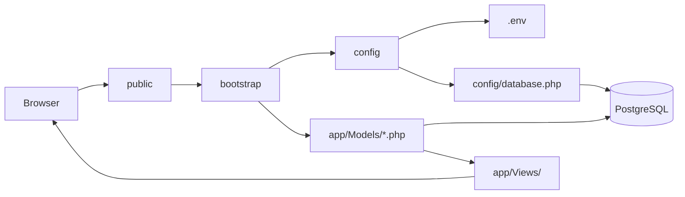

# Village Connect

**Community Social CMS** — platform for villages, neighborhoods, and local communities.

Members share posts with photos and video. Admins moderate content, manage users, handle incident reports, and run community challenges. Built with **PHP 8.3** and **PostgreSQL 16**.

> **Structure feels messy?** Start here → **[docs/STRUCTURE.md](docs/STRUCTURE.md)** (4 folders, 5 minutes).

### Structure in 30 seconds (MVC)

```text
public/router.php       → ENTRY  (front controller)
app/Http/Controllers/   → CONTROLLER  (handle request)
app/Models/             → MODEL  (features — 🔒 do not edit logic)
app/Views/              → VIEW  (HTML — safe to customize)
database/               → DATA  (tables — php database/migrate.php)
```

Details: [docs/STRUCTURE.md](docs/STRUCTURE.md) · Lock list: [docs/LOGIC_LOCK.md](docs/LOGIC_LOCK.md)

---

## Documentation

| Document | Description |
|----------|-------------|
| **[Structure (start here)](docs/STRUCTURE.md)** | **Simple 4-folder guide** — easiest way to understand the repo |
| **[Architecture](docs/ARCHITECTURE.md)** | Folder layout, request flow, where to add code |
| **[Logic lock](docs/LOGIC_LOCK.md)** | Protected files — avoid accidental logic changes |
| **[Installation Guide](docs/INSTALLATION.md)** | Local setup, migrations, troubleshooting |
| **[Features](docs/FEATURES.md)** | Complete feature list |
| **[Demo Guide](docs/DEMO.md)** | Demo accounts, URLs, buyer walkthrough |
| **[Database Schema](docs/DATABASE.md)** | Tables, relationships, migration reference |
| **[YouTube Video Guide](docs/YOUTUBE-GUIDE.md)** | Add YouTube videos to posts |

---

## Quick Start

Requires PHP 8.3+, PostgreSQL 16, and Composer.

```bash
cp .env.example .env
# Edit .env — DB_*, MAIL_*, optional OAuth / Cloudinary

composer install
php database/migrate.php
php database/seed_demo.php
```

Serve the `public/` folder:

```bash
php -S localhost:8080 -t public public/router.php
```

Open **http://localhost:8080**

---

## Demo Accounts

| Role | Email | Password |
|------|-------|----------|
| Admin | `admin@admin.com` | `admin123` |
| Author | `author@author.com` | `author123` |

**Change these before production.** See [docs/DEMO.md](docs/DEMO.md) for a full evaluation walkthrough.

---

## Requirements

- PHP 8.3+ with `pdo_pgsql`, `curl`
- PostgreSQL 16 (local or Supabase)
- Composer
- Git

---

## Tech Stack

| Layer | Technology |
|-------|------------|
| Backend | PHP 8.3 |
| Database | PostgreSQL 16 |
| Web server | PHP built-in server or Nginx + PHP-FPM |
| Frontend | Bootstrap 5, vanilla JS |
| Auth | Email/password + Google/Facebook OAuth |
| Media | Local uploads + optional Cloudinary |

---

## `public/` vs `app/Views/` — what’s the difference?

These are the two folders people confuse most. **Both can contain HTML**, but their jobs are different.

| | **`public/router.php`** | **`app/Views/`** |
|--|-------------------------|------------------|
| **Browser can open directly?** | ✅ Yes — every URL goes through router | ❌ No — loaded by PHP only |
| **Main job** | Match URL, bootstrap, load controller | Show HTML (layout, cards, forms UI) |
| **Analogy** | **Reception desk** — routes visitor to the right handler | **Display room** — what the visitor sees |
| **Has business logic?** | No — delegates to `Http/Controllers/` | Should be **HTML only** — no new rules |
| **Example file** | `public/router.php` | `app/Views/pages/contact.php` |

### How one page is built (contact example)

```text
User opens /contact
        │
        ▼
public/router.php                    ← ENTRY: match URL, bootstrap
        │
        ▼
Http/Controllers/Public/contact.php  ← validate POST, wire models + views
        │
        ├── calls app/Models/mail.php, rate_limit, …   (logic — do not break)
        │
        └── includes:
              app/Views/layouts/header.php   ← navbar, <head>
              app/Views/pages/contact.php    ← contact form HTML
              app/Views/layouts/footer.php   ← footer, scripts
```

**`Http/Controllers/Public/contact.php`** = process the form + wire things together.  
**`app/Views/pages/contact.php`** = markup only (fields, buttons, labels).

### Two styles in controllers (both normal)

| Style | Example | Where HTML lives |
|-------|---------|------------------|
| **Split** (cleaner) | `about.php` → `PageController` → `Views/pages/about.php` | Mostly `app/Views/` |
| **Mixed** (older) | `login.php`, `index.php` | PHP + HTML in controller |
| **Split controller + View** | `contact.php` + `Views/pages/contact.php` | Logic in controller, form HTML in `Views/` |

Admin controllers (`Http/Controllers/Admin/`) are mostly **mixed** — long files with table HTML + POST actions.

### Simple rule to remember

```text
router.php    = WHO gets the request (URL matching + bootstrap)
Controllers/  = HOW the page is handled (forms + redirects)
app/Views/    = HOW it looks (HTML templates)
app/Models/   = WHAT the rules are (login, posts, bans, mail)  ← 🔒 locked
```

---

## Customization guide — what you CAN and CANNOT edit

Use this when explaining the project to a buyer, teammate, or client.  
**Goal:** change design & text safely — **do not break features.**

### 🟢 Safe to edit (UI / content)

| Want to change… | Edit here |
|-----------------|-----------|
| Site header, navbar, footer | `app/Views/layouts/header.php`, `footer.php` |
| Admin sidebar | `app/Views/layouts/admin-nav.php` |
| About / FAQ / Privacy / Terms page layout | `app/Views/pages/*.php` |
| Post card on home feed | `app/Views/partials/news-card.php` |
| Comment thread look | `app/Views/partials/comment-item.php` |
| Colors, fonts, spacing | `public/css/style.css` |
| Client-side behavior | `public/js/main.js` |
| English / Khmer text | `app/Lang/en.php`, `app/Lang/km.php` |
| Logo, favicon | `public/icons/` |
| Docs for buyers | `docs/` |

### 🟡 Edit with care (UI + some request handling)

| File type | Risk |
|-----------|------|
| `Http/Controllers/Public/*.php` | May contain `if ($_POST)` — wrong change breaks forms |
| `Http/Controllers/Admin/*.php` | Admin actions (approve, ban, delete) mixed with HTML |
| `Http/Controllers/Api/*.php` | JSON shape must stay the same for JavaScript |

**Tip:** Change **HTML/CSS** freely. Avoid changing **SQL, auth checks, or redirects** unless you know PHP.

### 🔒 Do NOT edit (logic / features — locked)

| Path | Contains |
|------|----------|
| **`app/Models/*.php`** | Login, posts, comments, admin rules, uploads, OAuth, mail |
| **`config/*.php`** | Session, env, `requireLogin()`, database connection |
| **`database/migrations/`** | Database structure |
| **`bootstrap.php`**, **`app/bootstrap/core.php`** | Startup order |

See full list: [docs/LOGIC_LOCK.md](docs/LOGIC_LOCK.md)

### Find the right file from a URL

| URL | Start here | For HTML only, also check |
|-----|------------|---------------------------|
| `/` (home) | `Http/Controllers/Public/index.php` | `Views/partials/news-card.php`, `layouts/header.php` |
| `/login` | `Http/Controllers/Public/login.php` | — (HTML mostly in controller) |
| `/contact` | `Http/Controllers/Public/contact.php` | `Views/pages/contact.php` |
| `/about` | `Http/Controllers/Public/about.php` | `Views/pages/about.php` |
| `/post/slug` | `Http/Controllers/Public/post.php` | `Views/partials/comment-item.php` |
| `/admin/posts` | `Http/Controllers/Admin/posts.php` | `layouts/admin-nav.php` |
| Like button (AJAX) | `Http/Controllers/Api/like.php` | `app/Models/features.php` 🔒 |

### Explain to others in one sentence

> **“Change look & language in `Views/`, `css/`, and `Lang/` — don’t touch `app/Models/` or you break features.”**

---

## Project Structure — What each folder does

Every folder has one job. **HTTP requests only enter through `public/`** — everything else is loaded by PHP behind the scenes.

### Root files

| File / folder | Role | Used by |
|---------------|------|---------|
| **`.env`** | Secrets & settings (DB, mail, OAuth, Cloudinary) | `config/config.php` on every request |
| **`bootstrap.php`** | Full app startup (session, locale, admin settings) | `public/router.php` (public, admin, auth routes) |
| **`bootstrap-api.php`** | Lite startup (faster, no i18n/urls) | `public/router.php` (API routes) |
| **`composer.json`** | Lists PHP packages to install | `composer install` → creates `vendor/` |
| **`phpunit.xml`** | Test runner config | `vendor/bin/phpunit` |

---

### `public/` — Web root (browser hits here)

The **only** folder exposed to the internet. PHP requests go through one front controller.

| Subfolder / file | Role | Example URL |
|------------------|------|-------------|
| **`router.php`** | Front controller — bootstrap + dispatch to controllers | `/login` → `Http/Controllers/Public/login.php` |
| **`css/`, `js/`, `icons/`** | Static assets | `/css/style.css` |
| **`uploads/`** | Local uploaded images (optional; Cloudinary for CDN) | `/uploads/photo.jpg` |

**Flow:** `router.php` → `bootstrap.php` → `Http/Controllers/` → `app/Models/` → HTML or JSON.

---

### `app/` — Application code (not directly accessible via URL)

| Subfolder | Role | Called from |
|-----------|------|-------------|
| **`bootstrap/`** | Defines paths, loads Models in order, PSR-4 autoload | `bootstrap.php`, `bootstrap-api.php` |
| **`Models/`** | **All business logic** — posts, users, mail, OAuth, uploads, security | Controllers via bootstrap |
| **`Http/Controllers/`** | HTTP handling — public, admin, API, auth | `public/router.php` |
| **`Views/`** | HTML templates (layouts, partials, pages) | Controllers |
| **`Lang/`** | Translations (`en.php`, `km.php`) — `__('key')` | `app/Models/i18n.php` |

**Rule:** Put **rules & queries** in `Models/`. Put **HTML** in `Views/`. Put **HTTP handling** in `Http/Controllers/`.

---

### `config/` — Environment & database

| File | Role | Loaded by |
|------|------|-----------|
| **`config.php`** | Reads `.env`, defines constants (`APP_URL`, `DB_*`, …) | `bootstrap.php` (first) |
| **`database.php`** | Opens PostgreSQL connection → `$pdo` | Right after `config.php` |

**Flow:** `.env` → `config/config.php` → `config/database.php` → `$pdo` available everywhere.

---

### `database/` — Schema & demo data (CLI only, not web requests)

| File / folder | Role | When to run |
|---------------|------|-------------|
| **`migrate.php`** | Runs all migrations in order | `php database/migrate.php` (new server / after pull) |
| **`migrations/`** | Real migration SQL/logic (tables, columns) | Called by `migrate.php` |
| **`schema.sql`** | Base schema for empty database | Used by `bootstrap_schema.php` on first migrate |
| **`seeds/seed_demo.php`** | Demo users & posts | `php database/seed_demo.php` (dev only) |
| **`seed_demo.php`** | Shortcut → `seeds/seed_demo.php` | Same as above |
| **`setup.php`** | Fresh DB + schema + demo (destructive) | Rarely — only empty local Postgres |

**Flow:** CLI → `migrate.php` → `migrations/*.php` → PostgreSQL tables updated.

---

### Other folders

| Folder | Role | Notes |
|--------|------|-------|
| **`vendor/`** | Composer packages (Cloudinary, Web Push, PHPUnit) | Run `composer install` — do not edit by hand |
| **`storage/`** | Runtime cache & SQL backups | Auto-created; `storage/cache/*.json` |
| **`tests/`** | Automated tests | `vendor/bin/phpunit` — not used at runtime |
| **`docs/`** | Guides (install, features, database) | For developers / buyers |
| **`.github/workflows/`** | CI — runs tests on push to `main` | GitHub Actions |

---

## How folders connect (from → to)

### Web request (user opens a page)



```text
1. Browser          →  GET /login
2. public/router.php   matches → Http/Controllers/Public/login.php
3. router.php         → require bootstrap.php
4. bootstrap.php       → config/config.php      (reads .env)
                       → config/database.php    ($pdo)
                       → app/bootstrap/core.php (loads app/Models/*.php)
5. login.php           → checks login, queries users table via $pdo
6. app/Views/          → HTML sent back to browser
```

### API request (JavaScript like / follow)

```text
POST /api/like.php
  → public/router.php
  → Http/Controllers/Api/like.php
  → bootstrap-api.php        (lite — skips i18n)
  → app/Models/features.php    (toggle_post_like)
  → PostgreSQL
  → JSON response
```

### CLI (setup database)

```text
php database/migrate.php
  → config/config.php + database.php
  → database/migrations/*.php  (ALTER TABLE, CREATE TABLE, …)
  → PostgreSQL schema updated
```

### Where to edit what

| You want to… | Edit here |
|--------------|-----------|
| New public page | `Http/Controllers/Public/your-page.php` + `app/Models/route_registry.php` |
| Change layout / design | `app/Views/layouts/`, `public/css/` |
| Change business rules | `app/Models/*.php` |
| New DB table/column | `database/migrations/` → run `migrate.php` |
| Change DB password / URL | `.env` |
| Add Khmer/English text | `app/Lang/km.php`, `app/Lang/en.php` |

Full technical map: [docs/ARCHITECTURE.md](docs/ARCHITECTURE.md)

---

## Environment

Copy `.env.example` to `.env`. Key variables:

```env
APP_URL=http://localhost:8080
OAUTH_BASE_URL=http://localhost:8080
PRETTY_URLS=true
SESSION_DRIVER=database
DB_SSLMODE=require
```

Optional: `MAIL_*`, `GOOGLE_*`, `FACEBOOK_*`, `CLOUDINARY_*` — see `.env.example`.

---

## Database

```bash
php database/migrate.php
php database/seed_demo.php   # optional demo data
```

Reference: [docs/DATABASE.md](docs/DATABASE.md)

---

## Tests

```bash
composer install
vendor/bin/phpunit
```

CI runs on every push to `main` via GitHub Actions.

---

## License

Specify your license before selling (e.g. regular/extended for marketplaces). Add a `LICENSE` file if distributing commercially.

---

## Support for Buyers

Recommended: include 7–14 days of setup support and link to `docs/INSTALLATION.md` + `docs/DEMO.md`.
