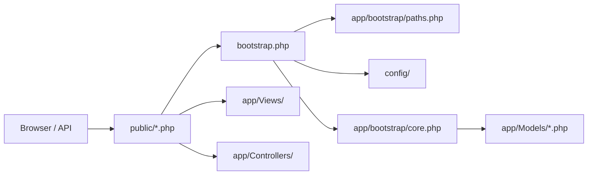

# Village Connect — Architecture

Professional layout map. **Business logic lives in locked zones** — see [LOGIC_LOCK.md](LOGIC_LOCK.md) and `.cursor/rules/logic-lock.mdc`.

---

## Directory tree

```
Village_Connect/
├── app/                          # Application layer (no public HTTP entry)
│   ├── bootstrap/                # Boot sequence only (paths, core loader, autoload)
│   │   ├── paths.php             # ROOT_PATH, APP_PATH, CONFIG_PATH, …
│   │   ├── core.php              # Ordered Core module loader (logic lock)
│   │   └── autoload.php          # App\ PSR-4 autoload
│   ├── Core/                     # 🔒 Business logic (procedural modules)
│   ├── Controllers/              # Thin page controllers (PageController)
│   ├── Views/                    # Layouts, pages, partials
│   └── Lang/                     # en.php, km.php translations
│
├── config/                       # 🔒 Environment & auth helpers
│   ├── config.php
│   └── database.php
│
├── database/
│   ├── schema.sql                # 🔒 Base schema
│   ├── migrate.php               # Migration orchestrator
│   ├── setup.php                 # Fresh DB + demo users/posts
│   ├── migrations/               # 🔒 Incremental migrations (real logic)
│   ├── seeds/                    # Demo seed scripts
│   └── migrate_*.php             # Wrappers → migrations/ (backward compat)
│
├── public/                       # Web root (HTTP entry points only)
│   ├── index.php, post.php, …    # Public pages
│   ├── admin/                    # Admin panel pages
│   ├── api/                      # JSON endpoints
│   ├── auth/                     # OAuth callbacks
│   ├── css/, js/, icons/
│   └── uploads/                  # User media (runtime)
│
├── storage/                      # Cache, backups (not in git)
├── docs/                         # Documentation
├── tests/                        # PHPUnit
├── bootstrap.php                 # Full app bootstrap (pages)
└── bootstrap-api.php             # Lite bootstrap (API)
```

---

## Request flow



| Entry type | Bootstrap | Core modules loaded |
|------------|-----------|---------------------|
| Public pages | `bootstrap.php` | Full (urls, i18n, verification, …) |
| API (`public/api/`) | `bootstrap-api.php` | Lite (no urls/i18n/verification) |

---

## Layer rules

| Layer | Role | Safe to edit for UI? |
|-------|------|----------------------|
| `public/` | HTTP routing, forms, HTML shell | ✅ Yes (careful with POST handlers) |
| `app/Views/` | Templates only | ✅ Yes |
| `app/Controllers/` | Page wiring | ⚠️ Thin changes only |
| `app/Models/` | **All business rules** | 🔒 Avoid unless intentional |
| `config/` | Env, session, auth gates | 🔒 Avoid unless intentional |
| `database/migrations/` | Schema changes | 🔒 New files OK; don't rewrite old ones |

---

## Module map (`app/Models/`)

| File | Domain |
|------|--------|
| `admin.php` | Admin CRUD, bans, settings, categories |
| `analytics.php` | Stats & CSV export |
| `backup.php` | DB backup helpers |
| `cloudinary.php` | CDN upload |
| `features.php` | Comments, posts helpers |
| `helpers.php` | Cache, flash, formatting, alerts |
| `i18n.php` | Locale |
| `mail.php` | SMTP templates |
| `member.php` | Notifications, follows, bookmarks |
| `oauth.php` | Google/Facebook login |
| `permissions.php` | Roles, session validation |
| `push.php` | Web push |
| `rate_limit.php` | Throttling |
| `routes.php` | CSRF, API security helpers |
| `security.php` | Headers |
| `uploads.php` | File validation |
| `urls.php` | Pretty URL builders |
| `verification.php` | Email verify, OTP |

---

## Database workflow

```bash
php database/migrate.php
php database/seed_demo.php   # optional demo data
```

Wrappers at `database/migrate_*.php` forward to `database/migrations/` so old docs/commands still work.

---

## Adding new code (without breaking logic)

1. **New public page** → `public/my-page.php` + optional view in `app/Views/`
2. **New API** → `public/api/my-action.php` + use `secure_json_api()` from `routes.php`
3. **New business rule** → add function to the correct `app/Models/*.php` module (or new module + register in `app/bootstrap/core.php`)
4. **New DB column** → new file in `database/migrations/` + register in `database/migrate.php` if tracked
5. **New translation** → `app/Lang/en.php` + `app/Lang/km.php`

Do **not** move or rename `app/Models/*.php` without updating `app/bootstrap/core.php` and all `require_once` references.
